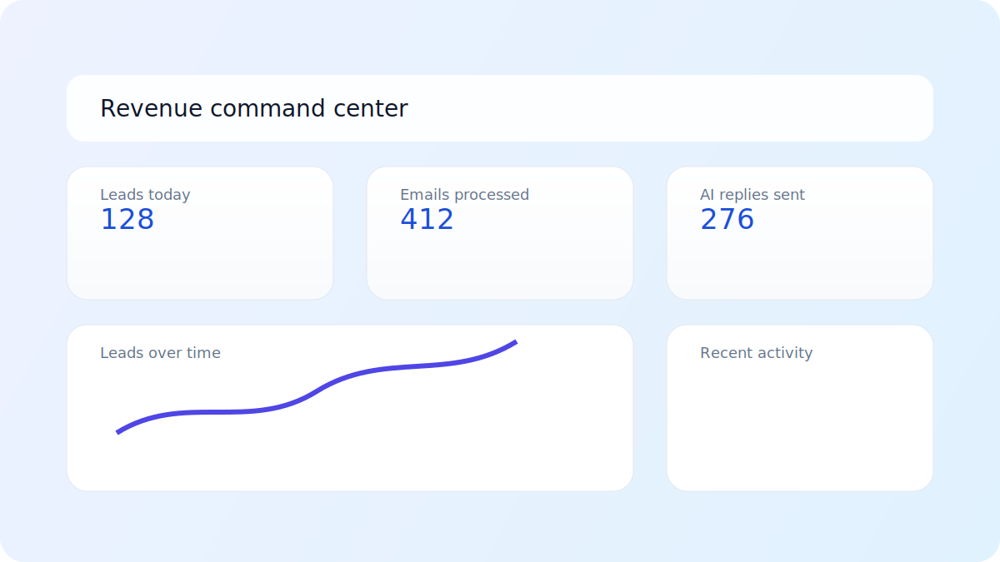
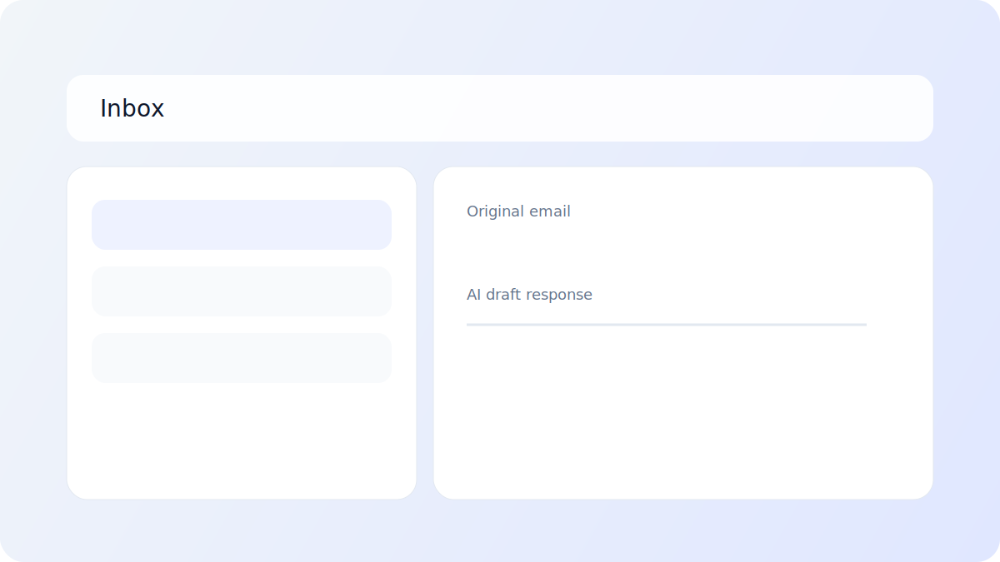

# AI Automation Portal

AI Automation Portal is a premium-style B2B SaaS platform for teams that manage high-volume inboxes and lead pipelines.

It combines inbox automation, lead prioritization, explainable AI replies, and business-focused analytics in one workspace.

## Product Positioning

**Problem**
- Revenue and support teams lose high-value conversations in crowded inboxes.
- Manual triage slows response times and lowers conversion.
- Leaders struggle to trust automation when decisions are not explainable.

**Who it is for**
- Sales teams that need faster follow-up and cleaner pipeline flow.
- Support teams that need SLA-safe triage and consistent responses.
- Founders and operators that need clear ROI and governance visibility.

**Value**
- Respond faster with AI-assisted triage and draft generation.
- Prioritize better with explainable lead scoring and urgency signals.
- Operate confidently with auditability, status visibility, and role-aware controls.

## Screenshots (Placeholders)





You can replace these placeholders with actual product screenshots later.

## Key Features

- Public SaaS landing page at `/` (no login wall)
- One-click demo mode at `/demo` with safe mock data
- Authenticated app shell under `/app/*` with protected routes
- AI chat widget on public landing page (no login required)
- Explainable AI panels (intent, urgency, confidence, rationale)
- Activity timeline, audit logs, privacy center, and system status views
- Role-aware UI (Owner, Admin, Agent, Viewer)
- Workspace switcher and multi-workspace-ready frontend state
- Enterprise mode and pitch mode for different buyer contexts

## Demo Mode

Demo mode is designed for sales demos, portfolio review, and onboarding.

- Uses mock inbox, lead, and analytics data
- Shows "Demo mode" clearly in UI
- No backend writes
- No settings persistence
- No external integrations

Open `http://127.0.0.1:5173/demo`.

## Tech Stack

- Frontend: React, Vite, Tailwind CSS, Recharts
- Backend: FastAPI, SQLAlchemy, Pydantic Settings
- Data: SQLite (local default), PostgreSQL (production)
- Async: Celery + Redis (optional)
- Auth: JWT access/refresh flow
- Observability: structured logs, request IDs, health/status endpoints

## Quick Local Run

Detailed local instructions: [LOCAL_SETUP.md](LOCAL_SETUP.md)

Short version:

```bash
# backend
python3 -m venv .venv
source .venv/bin/activate
pip install -r requirements.txt
cp .env.example .env
uvicorn app.main:app --reload
```

```bash
# frontend (new terminal)
cd frontend
npm install
cp .env.example .env
npm run dev
```

Open:
- App: `http://127.0.0.1:5173`
- API docs: `http://127.0.0.1:8000/docs`

## Deployment

Deployment guide: [DEPLOYMENT.md](DEPLOYMENT.md)

Supports:
- Docker / Docker Compose
- VPS (Ubuntu)
- Nginx reverse proxy
- IONOS-style VM hosting

## Architecture

See [ARCHITECTURE.md](ARCHITECTURE.md).

## Roadmap

See [ROADMAP.md](ROADMAP.md).

## Repository Notes

- No payments or billing included.
- Existing API contracts are kept compatible.
- Project is intentionally demo-friendly and portfolio-ready.
